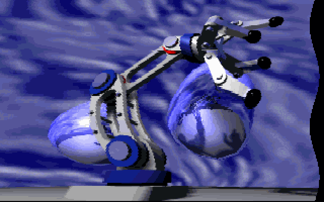
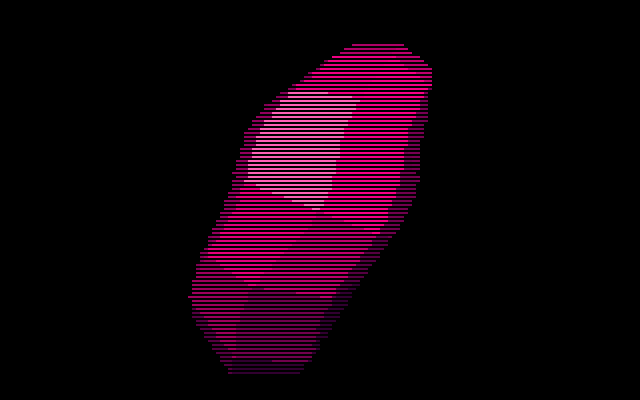
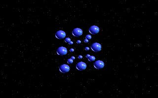
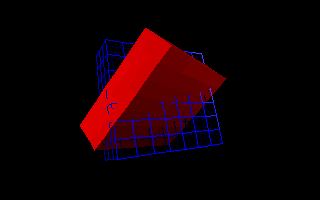
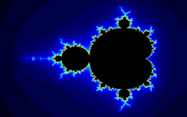
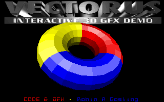
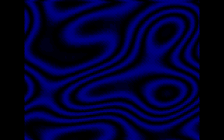
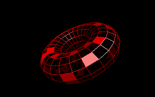

# GFX-13


> *Version 2.1 (C with inline Assembly)*

<br>

<p align="center">
  &emsp;
  &emsp;
  
</p>

<p align="center">
  &emsp;
  &emsp;
  
</p>
<p align="center">
  &emsp;
  &emsp;
  
</p>
<p align="center"><em>3D coded with my <a href="https://github.com/rohingosling/M3DE">M3DE</a> graphics engine.</em></p>

<br>

A VGA Mode 13h (320x200, 256 colors) 2D graphics library for old-school demo coding, written in C with Borland Turbo C++ inline assembly.

This is the upgraded version of my original pure assembly mode 13h graphics library ([GFX-13 v1](https://github.com/rohingosling/GFX13-v1-ASM)). I wrote this version to make it a bit easier to maintain and integrate into C++ programs. [GFX-13 v2](https://github.com/rohingosling/GFX13-v2-C) adds two new image blitting functions (`GetImage`, `ScaleImage`) and is backward compatible with [GFX-13 v1](https://github.com/rohingosling/GFX13-v1-ASM).

## 📑 Table of Contents

- [🏷️ Versions](#-versions)
- [✨ Features](#-features)
- [🧩 API](#-api)
- [🚀 Usage](#-usage)
- [🔨 Build](#-build)
- [🧪 Test Suite](#-test-suite)
- [📂 Repository Structure](#-repository-structure)
- [⚙️ Technical Details](#-technical-details)
- [📄 License](#-license)

## 🏷️ Versions

| Version | Language | Toolchain |
|---------|----------|-----------|
| [v1.1](https://github.com/rohingosling/GFX13-v1-ASM) | Pure x86 assembly | TASM |
| [v2.1](https://github.com/rohingosling/GFX13-v2-C) | Upgraded version written in C with inline assembly | Borland Turbo C++ 3.1 |

## ✨ Features

- Fast clipping
- Putting and getting pixels.
- Wireframe primitives.
- Filled primitives.
- Image blitting and scaling.

## 🧩 API

```c
// Mode Functions

void SetMode13      ( void );
void SetTextMode    ( BYTE rows );
BYTE GetTextMode    ( void );

// Palette and Clipping Functions

void SetPalette     ( BYTE col, WORD count, WORD segment, WORD dataOffset );
void SetClipping    ( int x0, int y0, int x1, int y1 );

// Screen Functions

void ClearScreen    ( BYTE col, WORD dest );
void FlipScreen     ( WORD source, WORD dest );
void WaitRetrace    ( void);

// Pixel Functions

void PutPixel       ( WORD x, WORD y, BYTE col,  BYTE clip, WORD dest );
BYTE GetPixel       ( WORD x, WORD y, BYTE clip, WORD source );

// Unfilled Primitives

void Line           ( WORD x0, WORD y0, WORD x1, WORD y1, BYTE col, BYTE clip, WORD dest );
void Triangle       ( WORD x0, WORD y0, WORD x1, WORD y1, WORD x2,  WORD y2,   BYTE col, WORD dest );
void Rectangle      ( WORD x0, WORD y0, WORD x1, WORD y1, BYTE col, WORD dest );
void Quad           ( WORD x0, WORD y0, WORD x1, WORD y1, WORD x2,  WORD y2,   WORD x3, WORD y3, BYTE col, WORD dest );

// Filled Primitives

void FillRectangle  ( WORD x0, WORD y0, WORD x1, WORD y1, BYTE col, WORD dest );
void FillTriangle   ( int  x0, int  y0, int  x1, int  y1, int  x2,  int  y2, BYTE col, WORD dest );
void FillQuad       ( int  x0, int  y0, int  x1, int  y1, int  x2,  int  y2, int  x3,  int  y3, BYTE col, WORD dest );

// Blitting Functions

void PutImage       ( WORD x,  WORD y,  WORD xs, WORD size, BYTE mask,      WORD source_seg, WORD source_offs, WORD dest );
void GetImage       ( WORD x0, WORD y0, WORD x1, WORD y1,   WORD source,    WORD dest_seg,   WORD dest_offs );
void ScaleImage     ( WORD x0, WORD y0, WORD x1, WORD y1,   WORD source_xs, WORD source_ys,  BYTE mask, WORD source_seg, WORD source_offs, WORD dest );

```

All `dest` and `source` parameters are 16-bit segment addresses (e.g., `0xA000` for VGA video memory).

## 🚀 Usage

```c
#include "gfx13.h"

#define VGA 0xA000

int main ( void )
{
    // Set mode-13h.

    SetMode13 ();

    // GFX-13 function calls (Version-2).

    ClearScreen  ( 0, VGA );
    FillTriangle ( 160, 10,  10,  190, 310, 190, 4, VGA ) ;
    Line         ( 0,   0,   319, 199, 15,  1,      VGA );
    PutPixel     ( 160, 100, 14,  1,                VGA);

    // Return to text mode.

    getch       ();
    SetTextMode ( 25 );

    // Exit program.

    return 0;
}
```

## 🔨 Build

Requires [DOSBox](https://www.dosbox.com/) (or real DOS) with Borland Turbo C++ 3.1 on PATH.

```bat
cd test
build.bat
```

Compiles `src/gfx13.c` and links 8 test programs with BCC (`-1` for 80186 mode, `-P` for C++ mode).

### Clean

Run `clean.bat` from the `test/` directory to remove build artifacts.

## 🧪 Test Suite

8 visual test programs are included:

| Test | Description |
|------|-------------|
| `testpix`  | Pixel drawing, reading, and screen clearing |
| `testline` | Line drawing with Bresenham's algorithm |
| `testrect` | Outline and filled rectangles |
| `testtri`  | Outline and filled triangles |
| `testquad` | Outline and filled quadrilaterals |
| `testimg`  | Image blitting with `PutImage` |
| `testpal`  | VGA palette manipulation |
| `testclip` | Clipping rectangle tests |

Each test program displays multiple screens. Press any key to advance between screens.

## 📂 Repository Structure

```
GFX13-v2-C/
├── src/              Library source
│   ├── gfx13.c       Library source (C with inline assembly)
│   └── gfx13.h       C-callable header (20 functions)
│
├── images/           Screenshot captures
│   └── capture/      Demo and test screenshots
│
└── test/             8 visual test programs
    ├── build.bat     Build script (BCC)
    ├── clean.bat     Clean build artifacts
    ├── testutil.h    Shared test utilities
    ├── testpix.c     Pixel drawing and reading
    ├── testline.c    Line drawing
    ├── testrect.c    Outline and filled rectangles
    ├── testtri.c     Outline and filled triangles
    ├── testquad.c    Outline and filled quads
    ├── testimg.c     Image blitting
    ├── testpal.c     VGA palette manipulation
    └── testclip.c    Clipping rectangle tests
```

## ⚙️ Technical Details

- **Target:** 80186+ real mode, small memory model
- **Resolution:** 320x200, 256 colors (VGA Mode 13h)
- **Pixel offset:** `y * 320 + x` computed via shifts as `y*256 + y*64 + x`
- **Line clipping:** Cohen-Sutherland algorithm
- **Filled polygons:** Scanline rasterization with 16.16 fixed-point DDA edge walking
- **Palette streaming:** `REP OUTSB` to VGA DAC (requires 80186+)

## 📄 License

Released under the [MIT License](LICENSE) — Copyright © 1991 Rohin Gosling.
